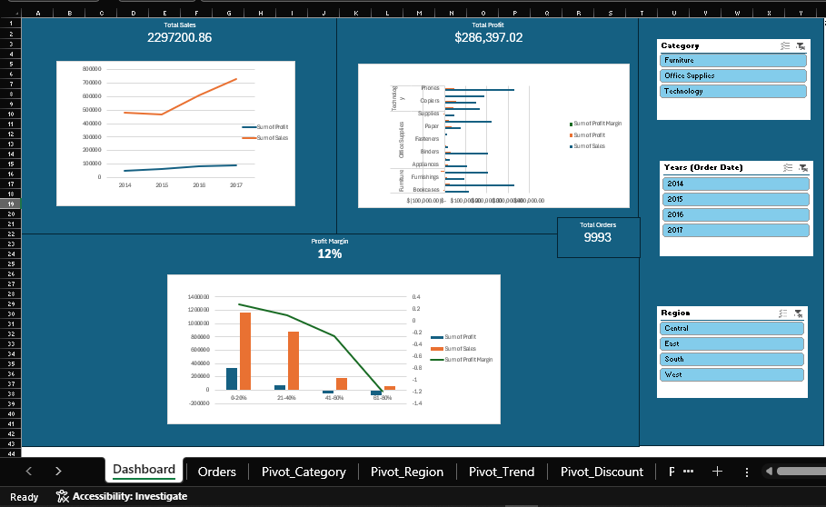
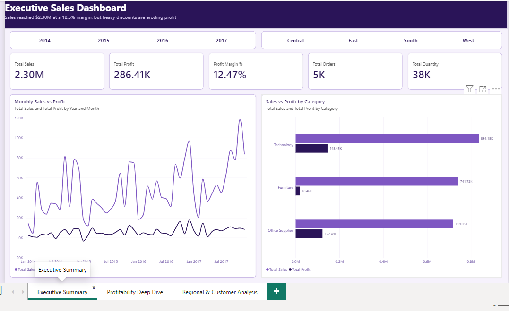
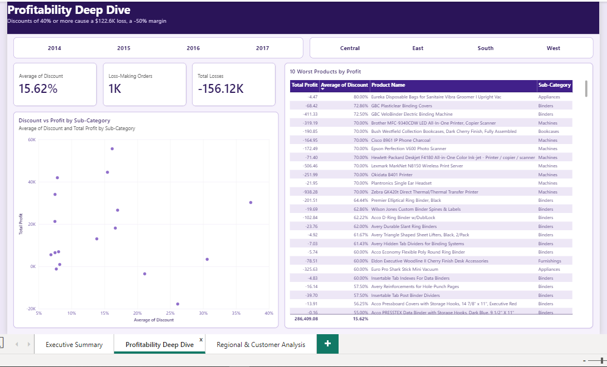
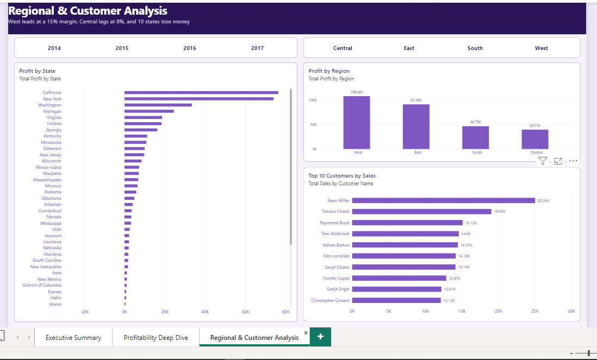

# Where Is Superstore Losing Profit, and How Can We Fix It?


> **A business-focused sales and profitability case study built using Excel and Power BI.**

---

## 📌 Business Problem

Superstore is a retail business selling products across multiple categories, regions, and customer segments.

Although total sales increased over the analyzed period, profitability was not distributed evenly across products, categories, regions, and discount levels. The goal of this analysis is to identify **where profit is being lost, what factors are driving those losses, and what actions could improve profitability.**

### Business Questions

This analysis aims to answer:

1. Which categories and products generate the most and least profit?
2. How does discounting affect profitability?
3. Which regions and states have weak profit performance?
4. How have sales and profit changed over time?
5. Which customers and segments contribute the most value?

---

## 📊 Dataset

* **Source:** [Kaggle – Superstore Dataset](https://www.kaggle.com/datasets/vivek468/superstore-dataset-final)
* **Records:** 9,993 rows
* **Columns:** 25 after transformation
* **Period:** January 2014 – December 2017
* **Granularity:** Order-line level
* **Key fields:** Order Date, Ship Date, Customer, Segment, Region, State, Category, Sub-Category, Product, Sales, Quantity, Discount, Profit

The dataset was transformed to support business analysis by adding:

* Year
* Month Name
* Profit Margin
* Shipping Days

---

## 🛠️ Tools Used

| Tool                           | Purpose                                                     |
| ------------------------------ | ----------------------------------------------------------- |
| **Microsoft Excel**            | Data analysis, Pivot Tables, KPIs and interactive dashboard |
| **Power Query**                | Data cleaning and transformation                            |
| **Power Pivot / Pivot Tables** | Aggregation and exploratory analysis                        |
| **Power BI**                   | Interactive business intelligence dashboard                 |
| **DAX**                        | Measures and profitability calculations                     |
| **GitHub**                     | Project documentation and portfolio presentation            |

---

## 🔄 Analytical Approach

### 1. Data Cleaning & Transformation

The dataset was prepared using **Power Query**.

Key steps included:

* Reviewing and validating data types
* Checking for duplicate records
* Checking missing/null values
* Creating Year and Month fields
* Calculating Profit Margin
* Calculating Shipping Days
* Preparing the dataset for Pivot Table and Power BI analysis

The final analytical dataset contains **9,993 records and 25 columns**.

---

### 2. Exploratory Analysis

Pivot Tables were created to investigate:

* Sales and profit by Category and Sub-Category
* Sales and profit by Region and State
* Sales and profit trends over time
* Profitability across discount levels
* Top and bottom-performing products

---

### 3. Profitability Analysis

The analysis focused not only on sales volume, but also on **profitability**.

Key metrics included:

* Total Sales
* Total Profit
* Profit Margin %
* Average Discount
* Year-over-Year performance
* Loss-making orders
* Product and category profitability

---

### 4. Visualization

Two interactive dashboards were created:

#### Excel Dashboard

Designed to demonstrate advanced Excel analytical skills using:

* KPI cards
* Pivot Charts
* Slicers
* Category analysis
* Regional analysis
* Sales and profit trends
* Discount analysis
* Product performance

#### Power BI Dashboard

The Power BI report contains three analytical views:

1. **Executive Summary**
2. **Profitability Deep Dive**
3. **Regional & Customer Analysis**

The dashboards were designed to move from high-level business performance to detailed profitability analysis.

---

## 📊 Dashboard Preview

### Excel Dashboard



### Power BI – Executive Summary



### Power BI – Profitability Analysis



### Power BI – Regional & Customer Analysis


---

## 💡 Key Findings

### 1. Furniture has strong sales but weak profitability

Furniture generated approximately **$741.7K in sales**, but only **$18.5K in profit**, resulting in a profit margin of approximately **2.5%**.

In comparison:

* Technology: **17.4% profit margin**
* Office Supplies: **17.0% profit margin**
* Furniture: **2.5% profit margin**

This indicates that high sales volume does not necessarily translate into strong profitability.

---

### 2. High discounts are strongly associated with negative profit

Orders with discounts above **40%** generated approximately **-$99.6K in total profit**.

The 21–40% discount range also generated a negative result of approximately **-$35.8K**.

This suggests that aggressive discounting can significantly erode profitability.

---

### 3. Profitability varies significantly by region

The **Central region** generated approximately **$39.7K in profit** from **$501.2K in sales**, resulting in a profit margin of only **7.9%**.

By comparison, the West region achieved approximately **14.9% profit margin**.

This highlights an opportunity to investigate regional pricing, discounting, product mix, and operating performance.

---

### 4. Sales increased substantially over the four-year period

Sales increased from approximately **$484K in 2014** to **$733K in 2017**.

At the same time, profit increased from approximately **$49.6K** to **$93.4K**.

However, profitability still varies considerably across products and business segments, meaning revenue growth alone should not be used as the primary measure of business performance.

---

### 5. A small number of products create significant losses

Several individual products generated substantial negative profit.

For example:

* **Cubify CubeX 3D Printer Double Head Print:** approximately **-$8.9K**
* **Lexmark MX611dhe Monochrome Laser Printer:** approximately **-$4.6K**
* **Cubify CubeX 3D Printer Triple Head Print:** approximately **-$3.8K**

These products should be investigated for pricing, discount levels, cost structure, or strategic fit.

---

## ✅ Business Recommendations

### 1. Review high-discount pricing policies

Introduce stricter discount controls, especially for discount levels above 20–40%, and require additional review for highly discounted orders.

### 2. Investigate low-margin product categories

Furniture should receive a deeper profitability review, particularly at the Sub-Category and Product levels.

Pricing, procurement costs, discount policies, and product mix should be evaluated before increasing sales volume further.

### 3. Investigate underperforming regions and products

The Central region and consistently loss-making products should be analyzed further to identify whether the issue is related to pricing, discounts, product mix, or operational factors.

---

## 🎯 Business Impact

The analysis demonstrates that **increasing sales is not enough to guarantee healthy business performance**.

By identifying loss-making products, controlling excessive discounts, and focusing on low-margin categories and regions, Superstore can make more informed pricing and product decisions while protecting profitability.

> **The key business takeaway: Revenue growth should be evaluated together with profitability, not in isolation.**

---


📁 Repository Structure

```text

Superstore-Profitability-Analysis/
│
├── Data/
│   └── Sample - Superstore.csv
│
├── Excel/
│   └── Superstore_Analysis_Styled.xlsx
│
├── PowerBI/
│   └── Executive_Sales_Dashboard_safe.pbix
│
├── images/
│   ├── excel-dashboard.png
│   ├── powerbi-executive.png
│   ├── powerbi-profitability.png
│   ├── powerbi-regional.png
│   └── project-demo.mp4
│
└── README.md
```

---

## 🎥 Project Demo

[▶️ Watch the Project Demo](images/project-demo.mp4.mp4)

---

## 📂 Project Files

* [Excel Analysis](Excel/Superstore_Analysis_Styled.xlsx)
* [Power BI Report](PowerBI/Executive_Sales_Dashboard_safe.pbix)
* [Dataset](Data/Sample%20-%20Superstore.csv)
---

## 👩‍💻 Author

**Zeinab Khaled**
Data Analyst | Business Information Systems Graduate

Interested in **Data Analysis, Business Intelligence, SQL, Excel and Power BI**.

[LinkedIn](https://www.linkedin.com/in/zeinab-khaled-9a5ab8416/)
